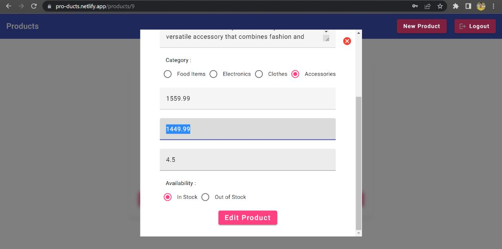

# Interview test - Products

This project was generated with [Angular CLI](https://github.com/angular/angular-cli) version 16.0.2.

This Project is Deployed with Netlify (https://pro-ducts.netlify.app/)

## Local Development

First, Clone this Repo then run command, `npm install`.

Next, Run `ng serve` for a dev server. Navigate to `http://localhost:4200/`. The application will automatically reload if you change any of the source files.

## Screenshot

## Backend

Backend APIs are Deployed with Cyclic.sh

Backend Code available at `/back-end`

## Build

Run `ng build` to build the project. The build artifacts will be stored in the `dist/` directory.

